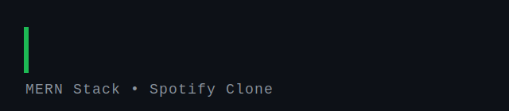

<p align="center">
  
</p>

<p align="center">
  
  
  
  
  
</p>

<p align="center">
  <b>A full-stack Spotify-style music streaming web app built with the MERN stack.</b><br/>
  Users can register, log in, browse music & albums, and upload tracks with authenticated, role-aware access.
</p>

---

## ✨ Features

- 🔐 **Authentication** — Register / Login / Logout with JWT stored in HTTP-only cookies.
- 🛡️ **Protected Routes** — Frontend route guards + backend middleware (`auth.middleware`).
- 🎵 **Music Library** — Browse all tracks, view details, and stream audio.
- 💿 **Albums** — Create albums and view album detail pages with their tracks.
- ⬆️ **Upload** — Authenticated users can upload audio + cover art (ImageKit media storage).
- 🎨 **Modern UI** — React 19 + Vite with a custom animated music-notes background.
- 🔗 **API Proxy** — Vite dev server proxies `/api` to the Express backend.

## 🧱 Tech Stack

| Layer    | Technology |
| -------- | ---------- |
| Frontend | React 19, React Router 7, Vite 8, Axios |
| Backend  | Node.js, Express 5, Mongoose 9, JSON Web Token, bcryptjs |
| Database | MongoDB (Atlas) |
| Media    | ImageKit (file/cover upload) |
| Auth     | JWT in HTTP-only cookies + cookie-parser |

## 📁 Project Structure

```text
spotify-mern-authentication/
├── backend/                # Express + Mongoose API
│   ├── src/
│   │   ├── controllers/    # auth & music logic
│   │   ├── db/             # MongoDB connection
│   │   ├── middleware/     # auth guard
│   │   ├── models/         # User, Music, Album schemas
│   │   ├── routes/         # /auth, /music
│   │   └── services/       # storage (ImageKit)
│   ├── .env.example        # template for your secrets
│   └── server.js
├── frontend/               # React + Vite SPA
│   ├── src/
│   │   ├── components/     # Navbar, Footer, MusicNotesBg
│   │   ├── contexts/       # AuthContext
│   │   ├── pages/          # Home, Login, Register, Dashboard, ...
│   │   └── services/       # Axios API client
│   └── vite.config.js
└── assets/
    └── typing.svg          # animated README banner
```

## 🚀 Getting Started

### Prerequisites

- Node.js 18+
- A MongoDB Atlas cluster
- An ImageKit account (for media uploads)

### 1. Clone

```bash
git clone https://github.com/ashrafumair111-lab/SpotifyLite-Full-Stack-App.git
cd SpotifyLite-Full-Stack-App
```

### 2. Backend setup

```bash
cd backend
cp .env.example .env      # then fill in YOUR values
npm install
npm run dev               # starts on http://localhost:3000
```

Your `backend/.env` should contain:

```env
MONGO_URI=mongodb+srv://<user>:<pass>@<cluster>/spotify
jwts=your_long_random_jwt_secret
IMAGEKIT_PRIVATE_KEY=your_private_key
IMAGEKIT_PUBLIC_KEY=your_public_key
IMAGEKIT_URL_ENDPOINT=https://ik.imagekit.io/your_id
```

> ⚠️ **The real `.env` is gitignored and never pushed.** Only `.env.example` is committed.

### 3. Frontend setup

```bash
cd ../frontend
npm install
npm run dev               # starts on http://localhost:5173
```

The Vite dev server proxies `/api` calls to `http://localhost:3000`.

### 4. Build for production

```bash
cd frontend
npm run build             # output in frontend/dist
```

## 🔌 API Reference

| Method | Endpoint                | Description            | Auth |
| ------ | ----------------------- | ---------------------- | ---- |
| POST   | `/api/auth/register`    | Create a new account   | ❌   |
| POST   | `/api/auth/loginuser`   | Log in                 | ❌   |
| POST   | `/api/auth/logout`      | Log out                | ✅   |
| GET    | `/api/music`            | List all music         | ✅   |
| POST   | `/api/music/upload`     | Upload a track         | ✅   |
| POST   | `/api/music/album`      | Create an album        | ✅   |
| GET    | `/api/music/albums`     | List all albums        | ✅   |
| GET    | `/api/music/album/:id`  | Get album by id        | ✅   |

## 🤝 Contributing

1. Fork the repo
2. Create a feature branch (`git checkout -b feature/awesome`)
3. Commit your changes (`git commit -m "feat: awesome"`)
4. Push (`git push origin feature/awesome`)
5. Open a Pull Request

## 📄 License

This project is licensed under the ISC License.

---

<p align="center">Made with ❤️ using the MERN stack</p>
